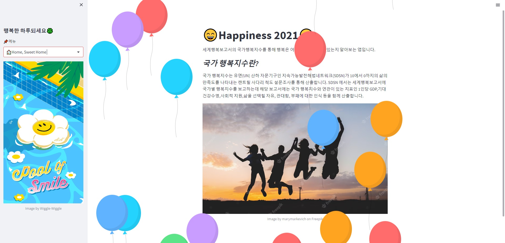

# 😄Happiness 2021😄
이 프로젝트는 세계 행복 보고서의 2021 국가 행복지수를 통해 각 나라들의 행복지수를 알아보고, 행복은 어떤 지표와 관련이 있는지 알아보는 앱입니다.


## 📖 Contents
😄Happiness 2021😄  
프로젝트 소개  
🌈 배경  
기술스택  
배포 주소 및 스크린샷  
📈 화면구성  
🙏 마무리


## 프로젝트 소개
세계행복보고서의 국가행복지수를 통해 행복은 어떤 지표와 관련이 있는지, 그리고 대륙별로 행복지수를 알아보는 앱입니다.


## 🌈 배경
*행복은 어떻게 측정이 가능할까?*
가장 행복한 나라 부탄! 부탄이라는 나라를 알리게 된 건 세계 행복 보고서 때문입니다. 세계 행복 보고서를 통해 행복이라는 건 측정할 수 있는 수치인가? 궁금해서 프로젝트를 진행하게 되었습니다.


## 기술스택
### 사용한 언어 
  

### 사용한 라이브러리  
 

### 사용한 툴  
       


## 배포주소 및 스크린샷
http://ec2-3-34-131-142.ap-northeast-2.compute.amazonaws.com:8502/



## 📈 프로젝트 설명
- 데이터는 2021년 국가 행복지수 데이터
  - kaggle(https://www.kaggle.com/datasets/unsdsn/world-happiness)  
- 컬럼 소개
  - 국가 이름 : 각 국가 이름  
  - 소분류된 대륙 : 서유럽, 동-중앙유럽, 남아메리카, 북아메리카, 동아시아, 동남아시아 등  
  - 대륙 : 유럽, 아메리카, 아시아, CIS(독립국가), 아프리카  
  - ladder score : 행복지수 측정법(켄트릴 사다리 척도조사)_정렬 기준  
  - 1인당 GDP(GDP per Capita) :  세계은행의 구매력 평가 기준  
  - 사회적 지원(Social Support) : 문제가 생겼을 때 도움을 줄 수 있는 사람 여부  
  - 기대 건강수명 (Healthy Life Expectancy) : 세계보건기구의 기대수명 기준  
  - 인생을 선택할 자유(Freedom to make life choices) : 삶에서 무엇을 할 것인지 선택할 자유에 만족하는지 여부  
  - 관대함 (Generosity) : 지난 한 달 동안 기부 여부  
  - 부패에 대한 인식(Perceptions of Corruption) : 부패가 만연하다고 생각하는지 여부  

- 세계지도를 통해 행복지수 차이를 색깔별로 시각화 하였습니다.

- 대륙별로 분류하여 행복지수를 비교하였습니다.

- 대륙별로 행복지수가 행복지수 평가 항목과 얼마나 연관되어 있는지 히트맵으로 비교하였습니다.  

- 상관관계 분석을 통해 1인당 GDP, 사회적 지원, 기대건강수명, 인생을 선택할 자유가 행복지수에 가장 영향을 끼치는 지표들이라고 나왔습니다.  


## 문제해결
- 문제 
  - plotly 에서 map을 그릴 때, locations와 locationmode 파라미터에 Country name 컬럼을 넣어, locationmode(국가코드)를 읽지 못했습니다.
```python
        fig4 = px.choropleth(df.sort_values("Ladder score"), 
                        locations = "Country name", 
                        color = "Ladder score", color_continuous_scale = 'GnBu',
                        locationmode = "Country name") # 컬럼명으로 작성
        fig4.update_layout(title = "국가 행복지수")
```
- 해결
  - locationmode에 'country names'라는 규정된 국가 코드를 입력했더니 지도가 나왔습니다.
```python
        fig4 = px.choropleth(df.sort_values("Ladder score"), 
                        locations = "Country name", 
                        color = "Ladder score", color_continuous_scale = 'GnBu',
                        locationmode = "country names") # 규정된 국가 코드로 변경
        fig4.update_layout(title = "국가 행복지수")
```


## 🙏 마무리
***
- 국가 행복지수를 보면 핀란드는 가장 행복한 나라고 아프가니스탄은 가장 행복하지 않은 나라입니다.
- 대륙별로 보면 유럽이 가장 행복한 대륙이고, 아프리카가 가장 불행한 대륙입니다.
- 대륙별로 행복지수에 가장 영향을 많이 준 지표는 1인당 GDP, 사회적 지원, 기대 건강수명, 삶을 선택할 자유입니다.  
- 관대함과 부패에 대한 인식은 행복지수에 크게 영향을 주지 않습니다.